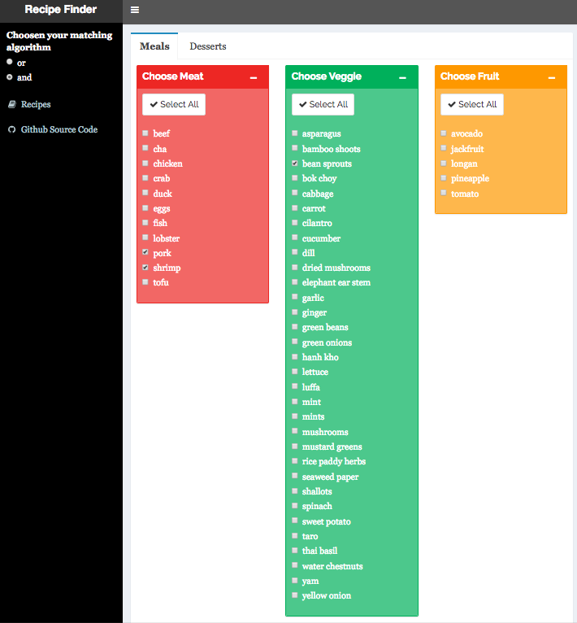
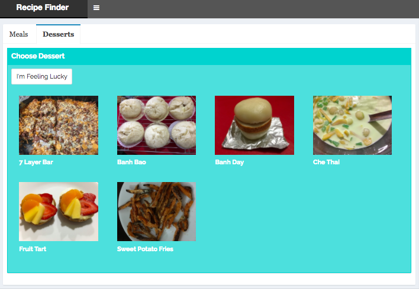

# Recipe Finder

## Check it Out!

<https://jennynguyen.shinyapps.io/recipe_finder/>

## Quick Summary

Don't let your food waste away in the refrigerator! Use the [Recipe Finder](https://jennynguyen.shinyapps.io/recipe_finder/) to search for delicious Vietnamese recipes!

The [Recipe Finder](https://jennynguyen.shinyapps.io/recipe_finder/) is an R Shiny application that searches through recipes available on [NhuyHoa's Recipes](https://nhuyhoa-recipes.netlify.app/post/) for selected ingredients. All recipe information is stored on cloud database, which both the website and the application pulls from. 

Click on any match to get the recipe! If you can't decide, click on the *I'm Feeling Lucky* button and we will find one for you!

The default matching algorithm searches for recipes that contain any of selected ingredients. This option can be set to display only the recipes that contain all of the selected ingredients. 

You can also view all dessert recipes and find a random dessert recipe to make.

New recipes are added daily, so check back soon!
